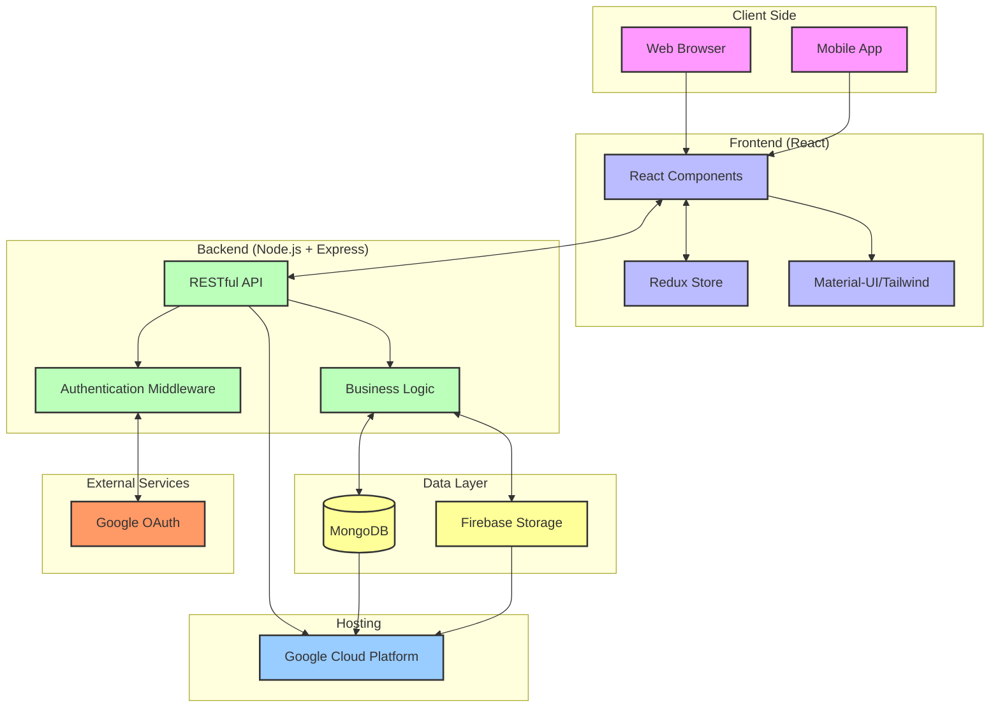

# InkTria ✒

## Description
InkTrail is a comprehensive web application designed to provide a feature-rich blog platform with advanced user management capabilities. It leverages modern technologies to deliver an engaging, efficient, and secure user experience for both content creators and readers.

## Features

#### User Authentication 🔐
- Custom user authentication system
- Google OAuth integration
- Email verification system

#### User Profile Management 👤
- Update user profile information
- Change user password
- Delete user account

#### Blog Management 📝
- Create, read, update, and delete blog posts
- Follow blog owners

#### Responsive Design 📱
- Mobile-friendly interface with intuitive navigation

## Technologies Used

- **Frontend**: React, TypeScript, Material-UI, Tailwindcss, Redux.
- **API**: Restful API.
- **Backend**: Node.js, Express.
- **Database**: MongoDB.
- **Authentication**: JWT, OAuth.
- **File Storage**: Firebase.

## Architecture


This diagram illustrates the architecture of the BlogSphere web application, covering both frontend and backend components, API layers, and integrations.

**Frontend**: The frontend is built using React for a dynamic user interface, with TypeScript for type safety. The UI components are styled with Material-UI and TailwindCSS, while Redux is used for state management, ensuring a predictable and efficient data flow within the application.

**API Layer**: The application follows the RESTful API design pattern, providing a clear separation of concerns between the frontend and backend.

**Backend**: The backend is powered by Node.js and Express, handling routing, API requests, and business logic.

**Database**: MongoDB serves as the primary data store, providing flexible and scalable storage for the application's data.

**Authentication**: User authentication is managed using JWT (JSON Web Tokens) for session management, and OAuth for third-party authentication, ensuring secure and seamless login experiences.

**File Storage**: Firebase is used for efficient file storage and retrieval, supporting user-uploaded content such as images or documents.

**Hosting**: The entire application is will deployed and hosted on Google Cloud, ensuring reliability and scalability for handling traffic and data.

This architecture ensures modularity, scalability, and security, providing a robust foundation for building a modern web application.

## Installation

### Prerequisites

- Node.js
- npm
- MongoDB
- Mailtrap token

### Steps to Set Up

1. **Clone the Repository**

    ```bash
    git clone https://github.com/yourusername/your-project.git
    cd your-project
    ```

2. **Install Frontend Dependencies**

    ```bash
    cd frontend
    npm install
    ```

3. **Install Backend Dependencies**

    ```bash
    cd ..
    npm install
    ```

4. **Set Up Environment Variables**

    Create a `.env` file in the root directory of both frontend and backend with the necessary environment variables:

    ```env
    DATABASE_URI=mongodb://localhost:27017/your-db
    JWT_SECRET=your_jwt_secret
    COOKIE_EXPIRE=cookie_expiretion_time_in_days
    MAILTRAP_TOKEN=your_mailtrao_token
    VITE_FIREBASE_API_KEY=your_vite_firebase_token
    ```

5. **Run the Application**

    Start the backend server:

    ```bash
    npm run start
    ```

## Usage

Explain how to use the application, including any available routes or features. For example:

- **Home**: `/welcome` - Displays the main page of the application.
- **Login**: `/login` - Allows users to log in.
- **Register**: `/register` - Allows new users to create an account.
- **Blog**: `/` - View and manage blog posts.
- **Profile**: `/profile` - View and edit user profile.

## Contributing

If you wish to contribute to this project, please follow these steps:

1. Fork the repository.
2. Create a new branch for your changes.
3. Make your modifications and ensure they work correctly.
4. Submit a pull request with a detailed description of your changes.

## License

This project is licensed under the [MIT License](LICENSE).

## Acknowledgements

- Thanks to my peers.
- Special thanks to AlX.

## Contact

For any questions or inquiries, please contact [Abdellah Hadid](https://www.linkedin.com/in/fokoda-code/).

---

Feel free to customize each section to better fit your project’s specifics and your preferences!
